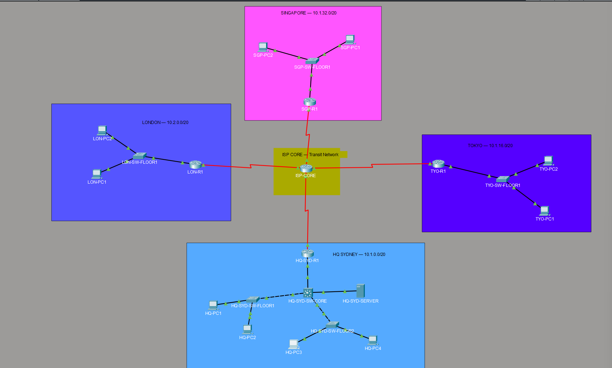

# AcmeCorp Global Enterprise Network

A multi-phase enterprise network built in Cisco 
Packet Tracer for CCNA 200-301 study and portfolio.

## Scenario
AcmeCorp is a global company with sites across 
4 continents, simulated in Cisco Packet Tracer 
with real enterprise design principles.

| Site | Location | Subnet |
|---|---|---|
| HQ | Sydney, Australia 🇦🇺 | 10.1.0.0/20 |
| Branch 1 | Tokyo, Japan 🇯🇵 | 10.1.16.0/20 |
| Branch 2 | Singapore 🇸🇬 | 10.1.32.0/20 |
| Branch 3 | London, UK 🇬🇧 | 10.2.0.0/20 |
| ISP Core | Transit Network | 10.x.254.0/30 |

## Project Phases

| Phase | Topic | Status |
|---|---|---|
| Phase 1 | IP Design & Subnetting | ✅ Complete |
| Phase 2 | Physical Topology | ✅ Complete |
| Phase 3 | VLANs & Inter-VLAN Routing | ✅ Complete |
| Phase 4 | OSPF Dynamic Routing | ✅ Complete |
| Phase 5 | DHCP & Network Services | 🔄 In Progress |
| Phase 6 | NAT & Internet Access | ⏳ Pending |
| Phase 7 | Security & ACLs | ⏳ Pending |
| Phase 8 | SD-WAN Simulation | ⏳ Pending |
| Phase 9 | IPv6 Dual Stack | ⏳ Pending |
| Phase 10 | Break & Fix Lab | ⏳ Pending |

## Key Concepts Implemented
- VLSM subnetting across 10.0.0.0/8 
  enterprise address space
- VLANs (802.1Q trunking, Router-on-a-Stick)
- OSPF multi-site dynamic routing
- Real troubleshooting documented throughout

## Troubleshooting Knowledge Base
Every issue hit during this build is documented 
in [knowledge-base.md](knowledge-base.md)

Real problems solved:
- DCE/DTE serial link mismatches
- Native VLAN mismatch causing STP blocking
- Asymmetric routing (return path missing)
- ARP resolution causing first ping failures
- VLAN port assignment mismatches

## Tools Used
- Cisco Packet Tracer
- VS Code
- GitHub

## Goal
CCNA 200-301 certification + real-world 
hands-on portfolio project.

After completing the build — someone will 
deliberately break this network and I'll 
troubleshoot it back to working. 🔧